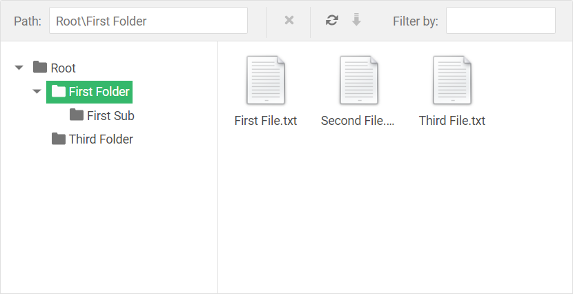

<!-- default badges list -->

<!-- default badges end -->

# File Manager for ASP.NET Web Forms - How to display virtual names of folders and files 
This example demonstrates how to display virtual names for folders and files in the [File Manager](https://docs.devexpress.com/AspNet/9032/components/file-management/file-manager) control. Users can access and manage folders and files by these virtual names.

This example implements a custom file system provider that transforms actual names of files and folders to virtual names and vice versa. The `foldersToShow` variable stores actual and virtual folder names. The `filesToShow` variable stores actual and virtual file names. Instead of variables, you can use another custom storage (for instance, a database).

## Files to Review

- [CustomPhysicalFileSystemProvider.cs](./CS/App_Code/CustomPhysicalFileSystemProvider.cs) (VB: [CustomPhysicalFileSystemProvider.vb](./VB/App_Code/CustomPhysicalFileSystemProvider.vb))
- [Default.aspx](./CS/Default.aspx) (VB: [Default.aspx](./VB/Default.aspx))
- [Default.aspx.cs](./CS/Default.aspx.cs) (VB: [Default.aspx.vb](./VB/Default.aspx.vb))

## Documentation

- [Custom File System Provider](https://docs.devexpress.com/AspNet/9907/components/file-management/file-manager/concepts/file-system-providers/custom-file-system-provider)

## More Examples

- [How to implement a custom file system provider for a List data source](https://github.com/DevExpress-Examples/asp-net-web-forms-file-manager-list-custom-file-system-provider)
- [How to implement a custom file system provider for LINQ to SQL data source](https://github.com/DevExpress-Examples/asp-net-web-forms-file-manager-linq-to-sql-custom-file-system-provider)
<!-- feedback -->
## Does this example address your development requirements/objectives?

 

(you will be redirected to DevExpress.com to submit your response)
<!-- feedback end -->
